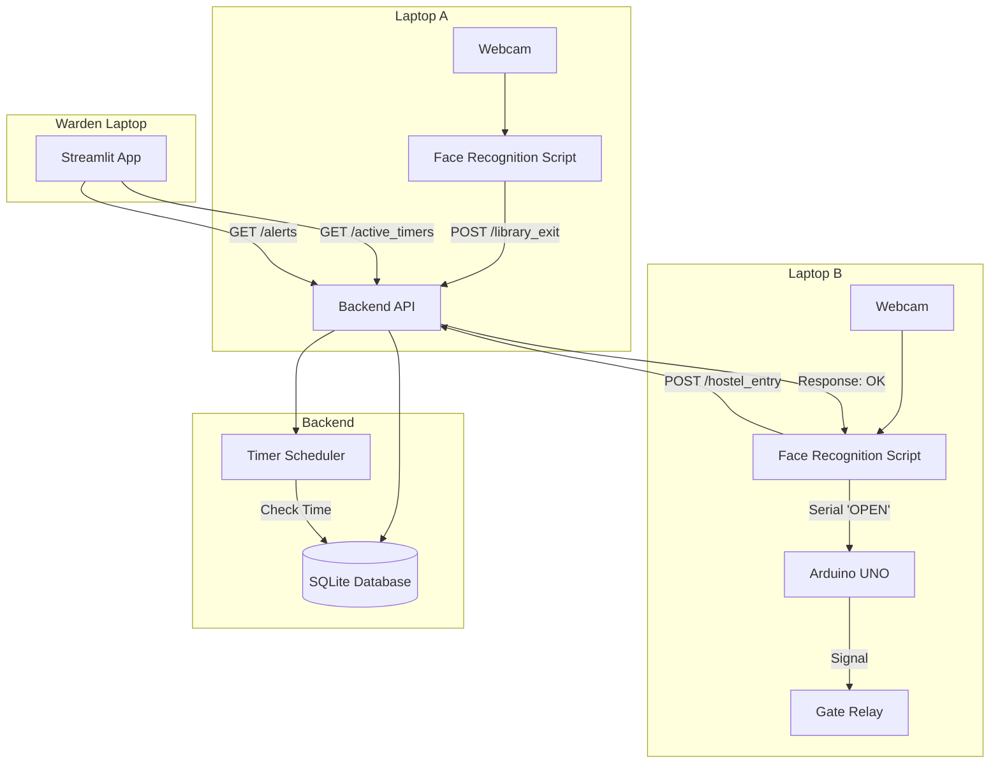

# System Architecture

## Overview
The system consists of three main nodes:
1. **Laptop A (Library Gate)**: Captures student exit.
2. **Laptop B (Hostel Gate)**: Captures student entry and controls the gate.
3. **Backend Server**: Central database and logic handler.

## Architecture Diagram (Mermaid)

## API Flow

### 1. Registration
- **User** runs `register_face.py`.
- **Script** captures face -> encodes -> POST `/register_student`.
- **Server** saves to DB.

### 2. Library Exit
- **Laptop A** detects face.
- **Script** matches face -> POST `/library_exit` with `student_id`.
- **Server** creates `Trip` record, sets `expected_end_time`, schedules check.

### 3. Hostel Entry
- **Laptop B** detects face.
- **Script** matches face -> POST `/hostel_entry` with `student_id`.
- **Server** finds active trip -> marks `completed` -> cancels scheduler.
- **Server** returns `open_gate: True`.
- **Laptop B** sends "OPEN" to Arduino.
- **Arduino** triggers Relay.

### 4. Late Arrival (Timer Expiry)
- **Scheduler** wakes up at `expected_end_time`.
- Checks if trip is still `active`.
- If yes -> marks `late` -> sets `is_alert = True`.
- **Dashboard** polls `/alerts` -> shows Red Alert.
